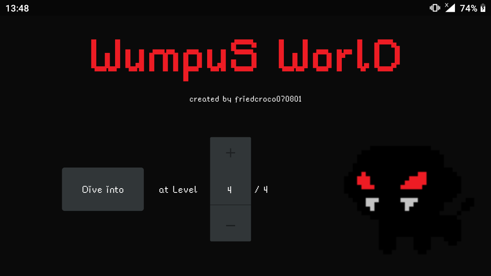
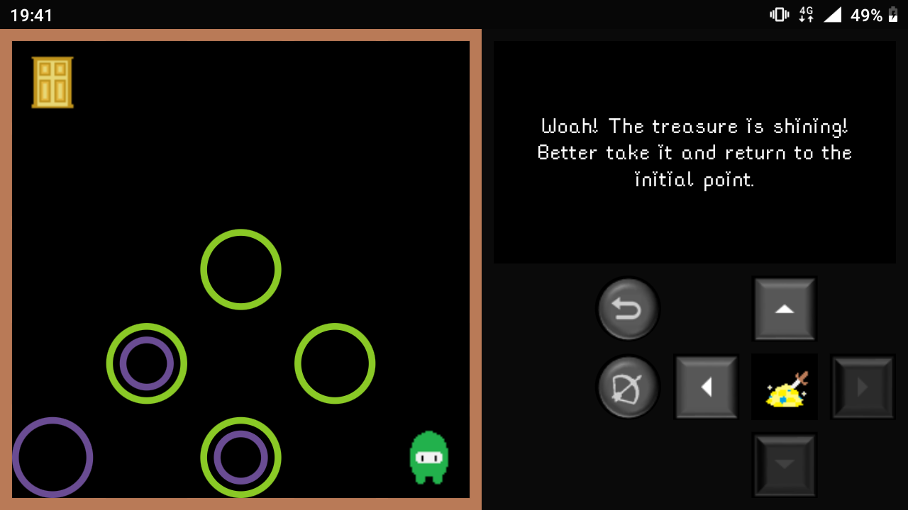
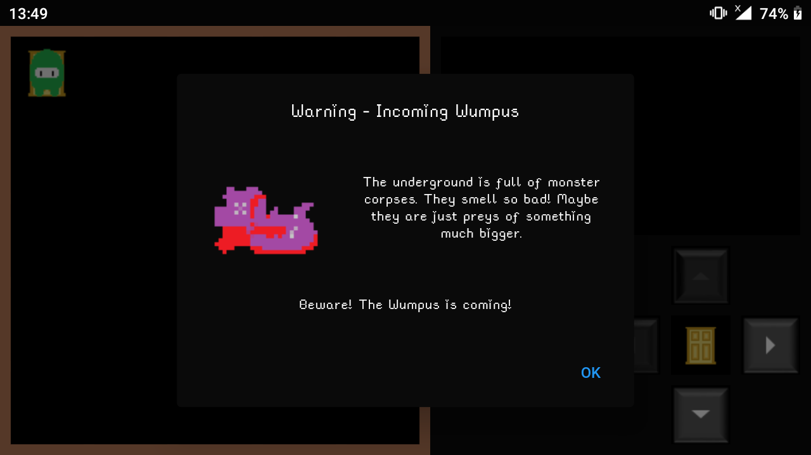
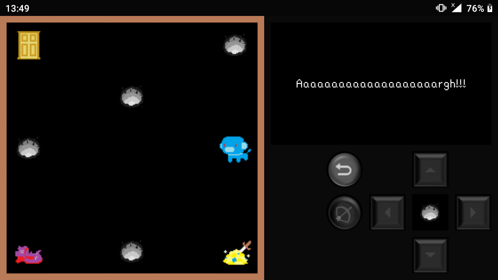
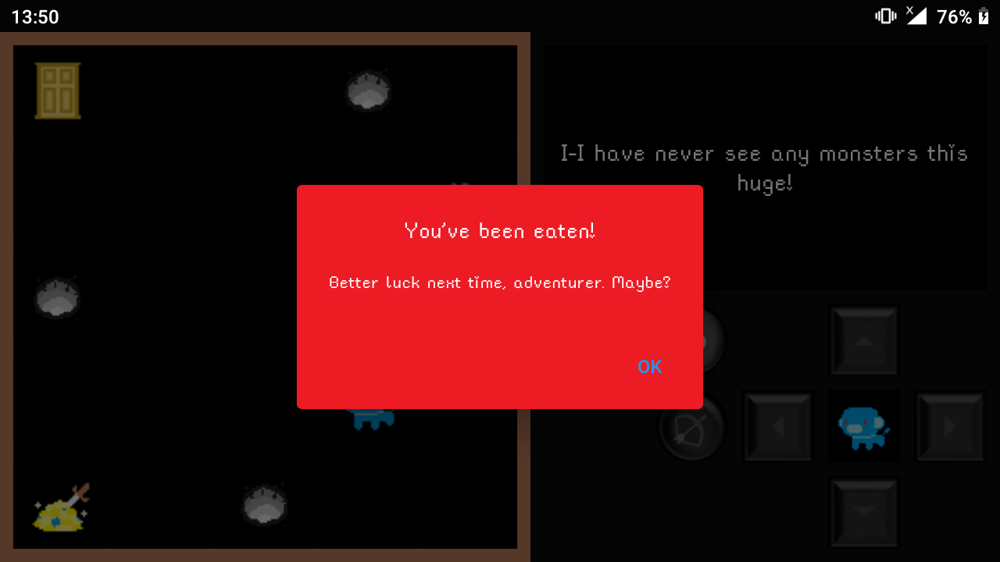

# About Wumpus World:
Wumpus World is an android horror game by friedcroco070801, inspired by the old Hunt the Wumpus game by Gregory Yob and Discord's Wumpus. Wumpus World focuses in pixel graphics and an strategy approach. It is free-to-play and suitable for everyone.

# System requirement:
The application is designed to be used on Android devices with Android version 4.1 and newer.

# Some screenshots:

# Installing:
## For Android
- *Step 1*: Download "wumpus-1.0.0.apk" file in folder \release\android.
- *Step 2*: Install the app. Make sure that your device allows applications from outside the Google Play Store to be installed.
- *Step 3*: Enjoy the game!
## Play directly on web
Not wanna wasting time? A webapp is for you:

<iframe src="release/web/index.html" width="720" height="405"></iframe>

# Technology used:
[Dart](https://dart.dev/)/[Flutter](https://flutter.dev/)

# Disclaimer:
This app is free and will not be used for any commercial purposes. Except Discord Wumpus model and the font used in the game which are not mine, all assets could be reused for personal purposes for free.

